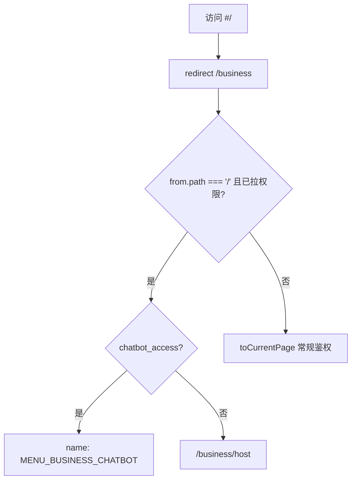

# Coding：业务视角首页 chatbot - 路由与布局

## 1. 目标与边界

| 项 | 说明 |
|----|------|
| **目标** | 模块平铺 `views/chatbot`；路由 `chatbot/:sessionCode?` 挂于 `/business`；顶栏「资源管理」**始终展示**；有权限时点击顶栏 / 默认首页 → chatbot；保留业务侧栏 + chatbot 双栏 |
| **不改** | Agent API；HITL/流式逻辑 |
| **权限** | **本迭代仅用老模式**：`store/common.ts` `pageAuthData` + `router/index.ts` `beforeEach` → `toCurrentPage`（`useVerify` / `chatbot_access`） |

---

## 2. 模块与路由（设计哲学：模块平铺）

```
views/chatbot/
  route-config.ts      # 导出 chatbotBiz
  index.vue
  children/
  AI_SPEC.md
```

| Symbol | 用途 |
|--------|------|
| **`MENU_BUSINESS_INDEX`** | `router/module/business.ts` 首组 **`path: '/business'`** 父路由 `name`，便于 `routerAction` 按模块名表达跳转 |
| **`MENU_BUSINESS_CHATBOT`** | chatbot 页路由 `name`（`chatbot/:sessionCode?`） |

| 项 | 值 |
|----|-----|
| **chatbot 路由 name** | `MENU_BUSINESS_CHATBOT` |
| **相对 path** | `chatbot/:sessionCode?` |
| **完整 URL** | `/business/chatbot`、`/business/chatbot/:sessionCode` |
| **注册** | `business.ts` 首组 `{ name: MENU_BUSINESS_INDEX, path: '/business', children: [...chatbotBiz, ...] }` |

**移除**：顶层 `indexViews`、`/chatbot` 独立路由、`views/index/route-config.ts`。

---

## 3. 默认首页与顶栏/侧栏权限



| 场景 | 行为 |
|------|------|
| 有 `chatbot_access` | 首次进入 `/` → **`/business/chatbot`**；点击顶栏「资源管理」→ `MENU_BUSINESS_CHATBOT` |
| 无 `chatbot_access` | 首次进入 `/` → **`/business/host`**；顶栏 **仍展示**「资源管理」，点击 → `MENU_BUSINESS_HOST_MANAGEMENT` |
| 左侧二级菜单「首页」 | 仅 `chatbot_access` 时展示（`meta.checkAuth: 'chatbot_access'`） |
| 直访 `/business/chatbot` 无权限 | `pageAuth` 匹配 → **403**（`toCurrentPage`） |

实现：

- `router/module/business.ts`：`MENU_BUSINESS_INDEX` 内联 `redirect`（按 `chatbot_access` 分流）
- `router/index.ts`：`/` → `/business`；首次进入且权限已拉取时，有 `chatbot_access` 再兜底到 chatbot
- `views/home/hooks/useChangeHeaderTab.ts`：顶栏 `business` → `routerAction.redirect({ name: MENU_BUSINESS_INDEX })`

---

## 4. 文件变更清单

### 4.1 路由与模块

| 操作 | 文件 |
|------|------|
| 迁移 | `views/index/chatbot/*` → **`views/chatbot/`** |
| 新增 | `views/chatbot/route-config.ts`（`MENU_BUSINESS_CHATBOT` + `checkAuth`） |
| 注册 | `router/module/business.ts`（父路由 `name: MENU_BUSINESS_INDEX`） |
| 删除 | `views/index/route-config.ts` |
| 更新 | `views/index.ts`（去掉 `indexViews`） |
| 更新 | `router/index.ts`（去掉 `...indexViews`，默认首页分流） |

### 4.2 顶栏与场景

| 文件 | 变更 |
|------|------|
| `router/header-config.ts` | 删除 `index`；`business.path` 保留兜底 |
| `views/home/index.tsx` | 顶栏 **不过滤** `business`；`getRouteLinkParams` 含 `MENU_BUSINESS_CHATBOT` |
| `router/module/business.ts` | `MENU_BUSINESS_INDEX` 内联 `redirect`（按 `chatbot_access`） |
| `views/home/hooks/useChangeHeaderTab.ts` | 顶栏 `business` → `MENU_BUSINESS_INDEX`（由路由 redirect 分流） |
| `hooks/useWhereAmI.ts` | 删除顶层 `/chatbot` → `Senarios.index` |
| `store/common.ts` | `chatbot_access.path` → `/^\/business\/chatbot/` |

### 4.3 权限（老模式）

- **不新增** `meta.auth.view` / `AUTH_AGENT_ASSISTANT`（本迭代）
- 左侧「首页」：`meta.checkAuth: 'chatbot_access'`（`home/index.tsx` 子菜单过滤）
- 直访无权限：`chatbot_access` + `toCurrentPage`

### 4.4 页面

| 文件 | 变更 |
|------|------|
| `views/chatbot/index.vue` | `routerAction` + **`MENU_BUSINESS_CHATBOT`** 同步 `sessionCode` |
| 样式 | **`.chatbot-page`**（及 `chatbot-sidebar` / `chatbot-main` 等）在业务侧栏存在时 flex 填满 |

### 4.5 Agent API

不变；`bizs` 仅 query，见 `api.md`。

---

## 5. 路由 meta 草案

```typescript
// business.ts 首组
{
  name: MENU_BUSINESS_INDEX,
  path: '/business',
  redirect: (to) => ({ name: chatbot_access ? CHATBOT : HOST, query: to.query }),
  children: [ /* chatbotBiz, host, ... */ ],
}

// views/chatbot/route-config.ts
{
  name: MENU_BUSINESS_CHATBOT,
  path: 'chatbot/:sessionCode?',
  component: () => import('./index.vue'),
  meta: {
    ...new Meta({
      owner: MENU_BUSINESS,
      title: '首页',
      activeKey: MENU_BUSINESS_CHATBOT,
      icon: 'hcm-icon bkhcm-icon-host',
      checkAuth: 'chatbot_access',
      layout: { breadcrumbs: { show: false } },
    }),
  },
}
```

---

## 6. 验收对照

- [ ] `MENU_BUSINESS_CHATBOT` → `/business/chatbot?bizs=`
- [ ] 有权限：`/` → `/business/chatbot`；顶栏「资源管理」→ chatbot；左侧有「首页」
- [ ] 无权限：顶栏仍有「资源管理」→ host；左侧无「首页」；`/` → `/business/host`
- [ ] 无权限直访 `/business/chatbot` → 403
- [ ] 无顶层 `/chatbot` 路由
- [ ] 左侧业务菜单在 chatbot 页可见
- [ ] 会话侧栏展开/收起（Figma 2006-6056 / 2031-829）

---

## 7. 不在此次提交

- `/chatbot` 旧链重定向
- `meta.auth.view` 新权限体系
- Agent `/bizs/{bizId}/` 路径改造
