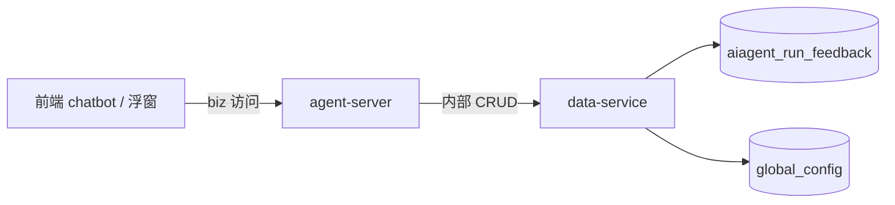

## Context

HCM Agent 已有业务会话（`aiagent_session`，对外钥匙 `session_code`，内部 `id` = 框架 `thread_id`）和 run 级观测账本规格（`aiagent_run`，已归档 `aiagent-run-data` / `aiagent-run-write`）。用户侧接口文档已合入：

- `docs/api-docs/web-server/docs/biz/agent/commit_feedback.md`
- `docs/api-docs/web-server/docs/biz/agent/delete_feedback.md`
- `docs/api-docs/web-server/docs/biz/agent/list_agent_config.md`

产品方案（主动反馈 4.3）把入口定为每条 Agent 回复下方常驻 👍 / 👎：单击只展开面板，点提交才写库。本设计**只覆盖后端**（agent-server / data-service / SQL / 后端接口文档）。不修改 `front/` 或任何前端代码。

方案原文里的「观测记录 / `aiagent_run_observation`」对齐本仓库已有账本表 **`aiagent_run`**，不另建观测表。

相关方：agent-server（编排与鉴权）、data-service（唯一写库）、运营（差评切片）、兄弟变更 `aiagent-model-eval`（left join 本表）。前端不在本期范围。



## Goals / Non-Goals

**Goals:**

- 一 run 最多一条用户反馈；赞踩互斥；按 `run_id` upsert
- 用户侧提交 / 撤销 / 白名单下发标签
- 运营看板列表不在本期（由 `aiagent-model-eval` 的 `/eval/dashboard/feedback/list` 承担）
- 标签闭集与文案走 `global_config`，改文案不用发版

**Non-Goals:**

- 不修改 `front/` 或任何前端代码；不实现前端赞踩 UI
- 不建压制表、不做频控、不恢复 `cooldownDays` / `minFinishedRuns`
- 不按 `run_id` 列表批量回查（已废弃 `batch_query`）
- 不把 `GET /config/list` 做成通用配置读取
- 不给反馈动作打 Prometheus 点
- 不创建 `aiagent_run`；不改 `hcm_aiagent_run_*` 口径
- 不实现模型评估看板的点踩×评分交叉（属 `aiagent-model-eval`）
- 反馈表不存 `session_code`

## Decisions

### 1. 分层：agent-server 编排，data-service 写库

**决策**：对外 HTTP 只挂 agent-server。反馈表与 `global_config` 读写一律经 data-service client。

**理由**：HCM 分层红线；与 `aiagent_session` 同一路径。

**替代方案**：agent-server 直连 MySQL → 禁止。

### 2. `session_id` 只存会话主键

**决策**：`aiagent_run_feedback.session_id` = `aiagent_session.id`（= `thread_id`）。commit 请求体必传 `session_id`，不传 `bk_biz_id`（取自 path）。服务端校验会话属于当前用户与当前业务。

**理由**：会话列表已返回 `id` 且与 `thread_id` 同值；`session_code` 仍是 `/agui` 对外钥匙，反馈链路不需要。

**替代方案**：对外钥匙改用 `session_code` → 与已定接口文档和方案 4.3 不一致。

### 3. API 与库列统一用 `reaction`

**决策**：对外、业务代码与库列都用字符串 `like` / `dislike`，列名 `reaction`。data-service 内部 list 的 `filter` 按项目惯例直接透传，不做字段改写或 0/1 映射。

**理由**：避免 API 与库列两套取值导致查询层必须做类型转换；`filter` 与其它列表接口一致。

**替代方案**：入库 tinyint `evalution`（0/1）→ 内部 list 必须把 `reaction` 改写成 `evalution`，和其它 Filter 透传接口不一致。

### 4. 覆盖写与改判清归因

**决策**：`uk_run_id` 保证一 run 一行。data-service 提供 Create + Update + List；agent-server 按 `run_id` 查到则更新，否则插入。并发插入撞唯一键时改为更新。改判（已有行 `reaction` 与本次不同）必须先清空旧 `tags` / `comment` 再写入本次字段。同态度再提交则只更新 `tags` / `comment`。

**理由**：点赞标签与点踩标签语义相反，留着会脏掉分类。

**替代方案**：再插一行做历史 → 违反「一 run 一行」；提供独立 patch 接口 → 与「一次 commit 写全量」文档不一致。

### 5. 单击展开不落库是前端约束

**决策**：后端只提供 commit upsert。允许 body 仅 `session_id` + `run_id` + `reaction`。不提供「预览 / 草稿」接口。

**理由**：写库时机由「面板点提交」保证；后端无法区分单击与提交。

### 6. 本期不校验 `aiagent_run` 终态

**决策**：commit 不查 `aiagent_run`、不校验 run 是否 `finished` / `error`。身份与业务以会话归属为准。代码留 TODO，后续若产品需要再补，不是本期必做。

**理由**：`aiagent_run` 尚未合入主干；阻塞提交会让本期反馈写库不可用。

**替代方案**：打桩直接 `Aborted` → 前端无法提交。

### 7. 标签校验读 `global_config`，不写死 enumor 闭集

**决策**：`reaction` 仍是代码闭集。`tags` 必须是当前 `reaction` 对应 map 的 key（`config_type=agent_feedback_tag`，`config_key=like|dislike`）。跨套或未知值 `InvalidParameter`，不静默丢弃。对应 map 缺失时只允许空 `tags`。`other` 不强制 `comment`。`comment` 上限 500 **字符**（`utf8.RuneCountInString`）。

**理由**：改文案 / 增删项不用发版；前后端同一数据源。

**替代方案**：enumor 写死标签 → 每次改标签要发版。

### 8. `GET /config/list` 白名单

**决策**：查询参数 `config_type` 必须在白名单；本期仅 `agent_feedback_tag`。名单外 `InvalidParameter`。鉴权只做业务访问；标签配置全局，不按业务过滤。挂在现有 `cmd/agent-server/service/config`。缺行或空 map 返回空 `details`，不 500。

**理由**：`global_config` 含 `auth/access_token` 等凭据，不能做成通用读取后门。

### 9. 不引入功能总开关

**决策**：本期不在 `pkg/cc` 增加反馈功能总开关配置。commit / delete / config list 均按正常逻辑处理，无需读取开关状态。

**理由**：功能上线即视为可用，简化配置面；如后续确需灰度或紧急下线，再按需补充。

### 10. 本期不提供对外 list

**决策**：agent-server **不** 提供 `GET /api/v1/agent/bizs/{bk_biz_id}/feedback/list` 与 `POST /api/v1/agent/feedback/list`。用户回查待前端接入时再补；运营查列表走兄弟变更 `aiagent-model-eval` 的 `POST /api/v1/agent/eval/dashboard/feedback/list`（join 账本与评估）。data-service 内部 `POST /aiagent/feedbacks/list` 仍保留，供 commit upsert / 撤销按 `run_id` 查找。

**理由**：运营看板已有专用 list，再暴露一条只读反馈表的原始明细会双入口；用户回查本期无前端调用方。

**替代方案**：保留 `POST /api/v1/agent/feedback/list` 给看板兜底 → 与 dashboard list 字段/join 口径不一致，调用方要维护两套。

### 11. data-service 内部接口形状

**决策**（内部，不对前端暴露）：

| 方法 | 路径 | 用途 |
|---|---|---|
| POST | `/aiagent/feedbacks/create` | 插入 |
| PATCH | `/aiagent/feedbacks` | 按 id 更新 |
| POST | `/aiagent/feedbacks/list` | 通用列表（按 run_id / session_id / user / reaction / tags json_contains 过滤，支持 sort） |
| DELETE | `/aiagent/feedbacks/batch` | 按 filter 删除 |

agent-server 组合这些接口完成 upsert / 撤销。读 `global_config` 用已有 `GlobalConfig.List`。

### 12. 模块落点

- 表 / DAO：`pkg/dal/table/aiagent/feedback.go`、`pkg/dal/dao/aiagent/feedback.go`，注册进现有 aiagent DAO set
- DS handler：`cmd/data-service/service/aiagent/` 增加 feedback 路由（可与 session 同包或分子文件）
- agent-server 用户侧：`cmd/agent-server/service/feedback/`，biz 路由 `/bizs/{bk_biz_id}`，复用 `authorizeBizSession`
- 配置：扩展 `cmd/agent-server/service/config`
- SQL：`scripts/sql/9999_<date>_aiagent_run_feedback.sql` 必须同时包含：
  1. `CREATE TABLE aiagent_run_feedback`（含 `idx_updated_at`）
  2. **`INSERT INTO global_config`** 写入 `agent_feedback_tag` 的 like / dislike 两行（见决策 13）

### 13. 用 SQL 写入 feedback tag，不用接口灌数

**决策**：标签 map 必须落在迁移脚本的 `INSERT INTO global_config`，随库表一起发布。`id` 必须从 `id_generator` 的 `resource=global_config` 当前 `max_id` 按 8 位 36 进制递增申请两枚，插入后把 `max_id` 更新为本次最大值，与应用层 `id_generator.Batch` 一致；禁止手写固定 id（会与后续 API 写入撞号，或占用非法序号）。`config_type` + `config_key` 已有唯一约束。JSON 可压成单行。不得改为启动时用 data-service API 灌数。

```sql
SELECT `max_id` INTO @gc_max_id
FROM `id_generator` WHERE `resource` = 'global_config' FOR UPDATE;
SET @gc_max_dec = CONV(@gc_max_id, 36, 10);
SET @gc_id_like = LPAD(LOWER(CONV(@gc_max_dec + 1, 10, 36)), 8, '0');
SET @gc_id_dislike = LPAD(LOWER(CONV(@gc_max_dec + 2, 10, 36)), 8, '0');
INSERT INTO `global_config` (`id`, `config_key`, `config_value`, `config_type`,
    `memo`, `creator`, `reviser`)
VALUES
(@gc_id_like, 'like',
 '{"accurate":"回答准确","complete":"内容完整","professional":"专业清晰",
   "solved":"解决了问题","well_formatted":"格式清晰","other":"其他"}',
 'agent_feedback_tag', 'HCM Agent like tags', 'system', 'system'),
(@gc_id_dislike, 'dislike',
 '{"factual_error":"事实错误","reasoning_error":"推理错误","incomplete":"内容不完整",
   "unprofessional":"内容不专业","calculation_error":"计算错误","harmful":"违法有害",
   "format_error":"格式错误","garbled":"乱码错误","duplicated":"内容重复",
   "chart_expected":"需画图但生成文本","other":"其他"}',
 'agent_feedback_tag', 'HCM Agent dislike tags', 'system', 'system');
UPDATE `id_generator` SET `max_id` = @gc_id_dislike WHERE `resource` = 'global_config';
```

**理由**：上线后 `GET /config/list` 立刻有 chips；commit 校验与下发同源。SQL 发布是现网改 `global_config` 种子数据的惯例。

**替代方案**：进程启动调 BatchCreate → 多副本重复插入、环境不一致；只建表不 INSERT → 前端无标签、非空 tags 全被拒。

## Risks / Trade-offs

- [依赖 `aiagent_run` 尚未合入主线] → 本期不校验 run 终态；commit 改校验会话归属。后续若需要再补，不是阻塞项。
- [白名单漏加 type 变成配置后门] → 白名单写死在代码，单测覆盖 `auth` 等敏感 type 必须 `InvalidParameter`。
- [改判不清旧 tags] → spec 强制覆盖语义；单测覆盖 like→dislike 后 tags 不含点赞 key。

## Migration Plan

1. 先合入建表 SQL **和** `INSERT INTO global_config` 的 agent_feedback_tag 两行（可早于接口；缺 INSERT 则配置接口返回空 details）。
2. 再合入 data-service 内部接口与 agent-server 对外接口。
3. 回滚：停接口后可保留表（数据只增用户反馈，无破坏性）。禁止用 `--force` 推共享分支。

## Open Questions

- 无。标签草案由产品在预置 SQL 前可改文案 / 增删 key；代码只认 `global_config`，不写死 tag 枚举。
