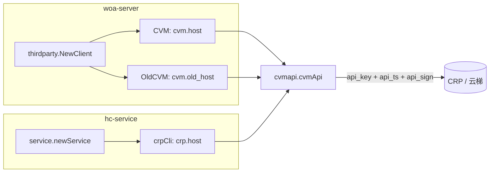

## Context

`pkg/thirdparty/cvmapi` 是 HCM 访问 CRP（云梯）JSON-RPC 接口的唯一出口，被 woa-server 与 hc-service 两个服务复用：

改造前 34 个接口方法各自调用 `WithParam(CvmApiKey, CvmApiKeyVal)`，密钥来自包级常量。改造后鉴权参数由客户端实例自身持有的密钥实时生成，密钥来源于服务配置。

## Goals / Non-Goals

**Goals**

- 鉴权参数生成逻辑单点收敛，34 个接口统一调用同一处，后续新增接口不易漏改。
- 密钥完全来自配置，代码内不再出现任何 api_key 明文。
- 启动期校验密钥缺失，失败前置。

**Non-Goals**

- 不改动 CRP 接口的路径、请求体与响应解析。
- 不引入新的第三方依赖（HmacSHA1 使用 Go 标准库 `crypto/hmac` + `crypto/sha1`）。
- 不为签名结果做缓存（时间戳需随请求变化，且计算开销可忽略）。

## Decisions

### 1. 签名参数生成收敛为 `cvmApi.authParams()`

在 `cvmApi` 结构体上新增 `apiKey`、`apiSecret` 字段，并提供 `authParams() map[string]string` 返回三元组，各接口用 `WithParams(c.authParams())` 一次性带上。

- `api_ts`：`time.Now().Unix()` 的十进制字符串（秒级，文档要求）。
- `api_sign`：`hex(HmacSHA1(apiSecret, api_ts + api_key))`，注意待签名文本顺序是**时间戳在前、api_key 在后**。
- 选择 `WithParams` 而非三次 `WithParam`：`rest.Request.WithParams` 内部是 append 语义，与逐个添加等价，但调用点更短、不易漏参。

**替代方案**：在 `rest.Client` 层做统一的请求拦截注入。放弃原因是 `rest` 是全项目共用的 HTTP 框架层，为单个第三方系统的鉴权方式增加钩子会污染公共层，且当前 `client.Capability` 无此扩展点。

### 2. 密钥配置分别落在两个服务各自的配置块

- woa-server：`cc.CVMCliConf`（yaml `cvm`）新增 `api_key`、`api_secret`。`CVM` 与 `OldCVM` 两个客户端共用同一组密钥，因为二者是同一云梯系统的新旧域名。
- hc-service：`cc.Crp`（yaml `crp`）新增 `api_key`、`api_secret`。

两处 `validate()` 均对空值返回错误，保持与 `tjj.secret_key`、`xship.secret_key` 等既有配置一致的失败前置行为。

**注意**：Helm 的 `hcservice/configmap.yaml` 用 `.Values.cvm` 渲染 `crp` 配置块，`woaserver/configmap.yaml` 也用 `.Values.cvm` 渲染 `cvm` 配置块，因此在 `cvm` 下补一次 `api_key`、`api_secret` 即可同时覆盖两个服务。

chart 默认 `docs/support-file/helm/values.yaml` 里没有 `cvm` 块（`tjj`、`xship`、`tencentcloud`、`erp`、`tmp`、`tcaplus`、`tgw`、`l5`、`safety`、`caiche`、`dvm` 等自研云第三方配置同样缺失），这批配置一律由部署侧的环境 values 提供，因此本次不改动默认 values，密钥补齐工作落在部署侧。由于 `ClientConfig.validate()` 对这些字段强校验，环境 values 漏配时服务启动即失败，不会静默上线。

`crp` 配置块会连带拿到 `cvm` 下的 `old_host`、`launch_password`，`cc.Crp` 结构体没有对应字段。`pkg/cc/load.go` 使用非严格的 `yaml.Unmarshal`，多余字段被忽略，无需为 `crp` 单独拆分 values 块。

### 3. `NewCVMClientInterface` 校验密钥非空

除了配置层 `validate()`，客户端构造函数也校验一次。原因是 `cvmapi.CVMCli` 是可被任意调用方构造的公开结构体（hc-service 就是直接手写字面量构造的），在构造处兜底可避免新接入方漏传密钥后运行期才暴露成 CRP 侧鉴权失败。

### 4. 移除 `CvmApiKeyVal` 常量而非保留

`cmd/woa-server/logics/plan/fetcher/crp.go` 把该常量当作 `queryOrderList` 的业务入参 `UserName`（云梯侧该用户名恰好就是 api_key 名）。改为读取 `cc.WoaServer().ClientConfig.CvmOpt.ApiKey`，语义等价且不再有第二处硬编码。常量彻底删除，防止后续新代码继续引用。

### 5. 失败日志不打印完整配置

`thirdparty.go` 原先在客户端创建失败时 `logs.Errorf("..., conf: %v", cvmConf)`，配置结构体加入 secret 后会把密钥写进日志。改为只打印地址字段。

## Risks / Trade-offs

- **配置未补齐导致启动失败**：这是刻意选择的失败前置。缓解方式是发版前先更新各环境 values/configmap，再滚动重启；且 `api_key` 本身原先就写死在代码常量里，沿用同一个值即可，只需新增 secret。
- **时钟漂移**：签名时间戳来自 HCM 本机时间，若容器时钟与云梯侧偏差超过有效期（默认 10 分钟）会鉴权失败。属于既有基础设施保障范围，不额外处理。
- **旧域名 `old_host` 是否支持签名**：按云梯文档签名鉴权对 api_key 生效而与域名无关，二者共用同一密钥。若上线后发现旧域名不兼容，只需回退 `OldCVM` 的构造参数，不影响其他调用。

## Migration Plan

1. 合并代码（此时配置样例已带占位值，本地/测试环境需填真实密钥）。
2. 各环境 Helm values 的 `cvm` 块补充 `api_key`、`api_secret`。
3. 先在测试环境重启 woa-server、hc-service，验证 CRP 查询类接口（如需求预测列表、机型列表）返回正常。
4. 正式环境滚动发布，重点观察 CRP 提单类接口的鉴权错误码。

## Open Questions

- 生产环境的 api_secret 由云梯侧申请邮件提供，需在发布前确认已录入配置中心/Helm values。
