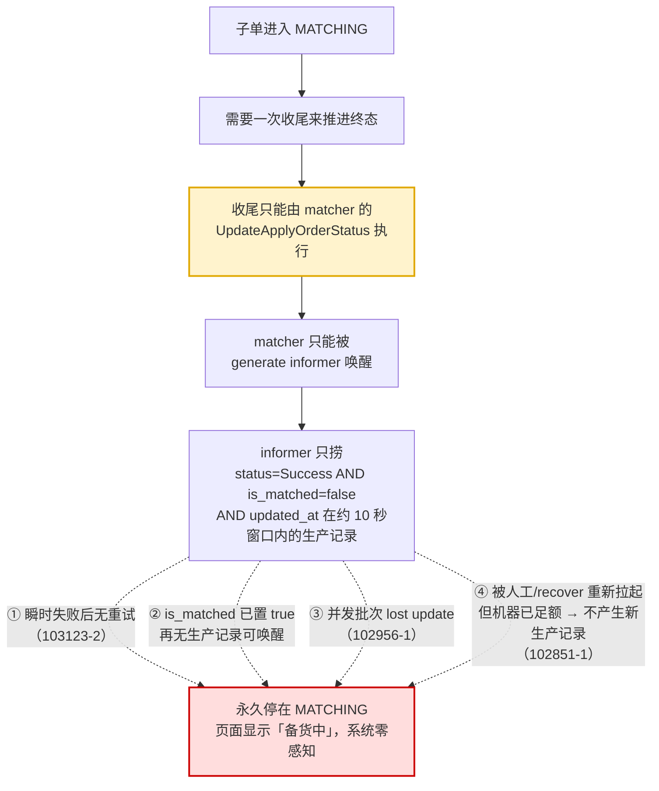
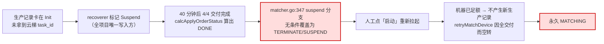

# 主机申请子单永久卡死 MATCHING 的修复路径

## Why

线上已发现三张 ziyan 主机申请子单（102851-1、102956-1、103123-2）永久停在 `stage=RUNNING / status=MATCHING`：机器已全部交付、四个步骤（下单/生产/初始化/交付）全部成功、配额与交付核数也已正确记账，但单据永远不会流转到终态。三张单全部由用户报障才发现，其中 102851-1 卡了 20 天以上。

三张单的触发点各不相同，但卡死的结构是同一个：

三个条件一旦不再同时成立，就没有任何机制能把这张子单推到终态。

其中 102851-1 的成因链最完整，也是唯一可稳定复现的，它同时暴露了上下游两个缺陷：

下游缺陷：`matcher.go:347` 的判定 `isSuspend && suspendCnt+matchedCnt >= TotalNum` 在 `calcApplyOrderStatus` 已算出 DONE 之后无条件覆盖，且 `suspendCnt` 累加的是挂起记录的 `TotalNum`（整单数量）而非缺口数量，导致只要存在任一 Suspend 记录该条件几乎必然成立。已交付满额的单被误判为 TERMINATE/SUSPEND。

上游缺陷：`generator.retryMatchDevice` 的职责是「重新调度但无需生产时，重置生产记录唤醒 matcher 收尾」，但它的过滤条件只重置 `!IsDelivered` 设备对应的记录。102851-1 的全部设备已交付，过滤结果为空，没有任何记录被重置，informer 不会再唤醒 matcher——用户点了「启动」，单据照旧卡死。

## What Changes

本变更聚焦**修复路径**，让已交付满额的子单能通过既有的人工重试入口正常流转。

- **A. suspend 覆盖增加前置条件（下游，预防）**：`matcher.go:347` 增加 `matchedCnt < TotalNum` 守卫，已交付满额的单不再被误判为 TERMINATE/SUSPEND，直接按 DONE 落库。跳过覆盖时向子单 `remark` 追加核对标记，保留人工核对幽灵机器的入口。
- **B. 机器已足额时重试能真正唤醒收尾（上游，治疗）**：`generator.retryMatchDevice` 在原有 `!IsDelivered` 过滤结果为空、且已交付数量已达子单需求时，补选一条生产记录重置 `is_matched=false`，让 informer 重新唤醒 matcher 执行一次收尾。用户点「启动」后，已交付满额的子单能正常落到 DONE。

A 是 B 的前置：没有 A，B 触发的收尾可能被 347 行重新打回 TERMINATE。两者需在同一个变更中合入。

### 明确不在本次范围

- 不修复已卡死的三张存量单据（需人工解卡；102851-1 已超出 recoverer 的 15 天捞取窗口）。
- 不做卡死子单的周期性检测、告警、自动恢复与收尾失败留痕。102956-1（并发 lost update）与 103123-2（瞬时失败）不在本次覆盖，其解卡依赖人工重试——B 落地后该动作对已满额交付的单有效。
- 不做多服务层（resource 层）改动。
- 不修 `GetCpuCoreSum` 中 `verifyGroupMap[key] += deliveredCore` 累加 running total 的问题（影响多机型/多可用区单的预测扣减金额，属独立缺陷，另行评估）。
- 不修多批次交付重复写 changelog 的存量问题，见 Impact 中的行为兼容性说明。
- 「已有设备全交付、数量不足、且在途批次永久卡在 Init」这一变种不在本次范围：其对应机制是 recoverer 将卡住的生产记录判失败后由补生产流程恢复，真实缺陷在 recoverer 的执行时机，而非本次的唤醒条件。

## Capabilities

### New Capabilities

- `apply-suborder-retry-wakeup`: 主机申请子单在已足额交付场景下的人工重试唤醒能力，使「机器已够、不产生新生产记录」的子单仍能通过既有重试入口触发一次收尾，进入终态。
- `apply-suborder-finalize-suspend-guard`: 主机申请子单收尾时 suspend 状态覆盖的判定约束，保证已交付满额的子单不被误判为备货异常，同时保留挂起生产记录的人工核对信号。

### Modified Capabilities

（无。现有 `openspec/specs/` 下无覆盖主机申请子单状态机与 matcher 收尾的能力。）

## Impact

- **woa-server（service 层）**：
  - `cmd/woa-server/logics/task/scheduler/matcher/matcher.go`：`UpdateApplyOrderStatus` 的 suspend 覆盖分支增加守卫。
  - `cmd/woa-server/logics/task/scheduler/generator/generator.go`：`retryMatchDevice` 增加「已足额交付时补选一条生产记录重置」的兜底分支。
- **数据层**：仅新增写入既有字段（生产记录 `is_matched`、子单 `remark`），不新增表、不改表结构。
- **行为兼容性**：
  - A 改变的是「存在 Suspend 记录且已交付满额」这一窄场景下的终态取值（TERMINATE → DONE）。部分交付、升降配等其他路径行为不变。Suspend 记录仍会照常被 `updateGenerateFailed` 改为 Failed，审计痕迹与地雷清除均不受影响。
  - B 仅在 `retryMatchDevice` 原有过滤结果为空且已交付数量达子单需求时生效，对仍存在未交付设备的子单行为完全不变。被唤醒的 matcher 走完整条 `informer → matchHandler → matchDevice → FinalApplyStep` 链路，初始化/交付各步对已完成设备均有早返回，不会重复执行。
  - B 触发的收尾会走到 `AddMatchedPlanDemandExpendLogs`。该写入链路自 2025-08 起已停止产出（`res_plan_demand_changelog` 的 `expend` 类型零新增），且 B 的触发频率受人工点击约束，不构成新增的预测扣减风险。
- **多服务层影响**：仅涉及 service 层（woa-server），未触及 resource 层。

## Open Questions（待确认，不阻塞本次实现）

### D1. 预测扣减链路失效是否需要单独跟进

`res_plan_demand_changelog` 的 `expend` 类型记录自 2025-08-20 起停止写入，而 `append`/`adjust` 类型正常，说明预测需求与调整链路存活、唯独「交付后扣减」链路失效。同期 DONE 子单约 11554 张，仅 8 张产生了扣减记录。

该问题与本变更无代码耦合（B 的触发不依赖该链路存活），但属于本次排查的副产品发现，影响业务方预测额度的准确性。是否单独立项跟进，需业务方确认。

### D2. B 的兜底分支是否需要配置开关

B 的生效条件是「重试 + 已足额交付」，属于窄场景且行为可预测。但考虑到它改变了人工重试的下游效果（从「照旧卡死」变为「推进终态」），是否需要一个 cc 配置开关以便异常时快速回退，需在实现前确认。

倾向不加：行为本身符合用户点击「启动」时的预期，且回滚成本低（代码回退即可）。
