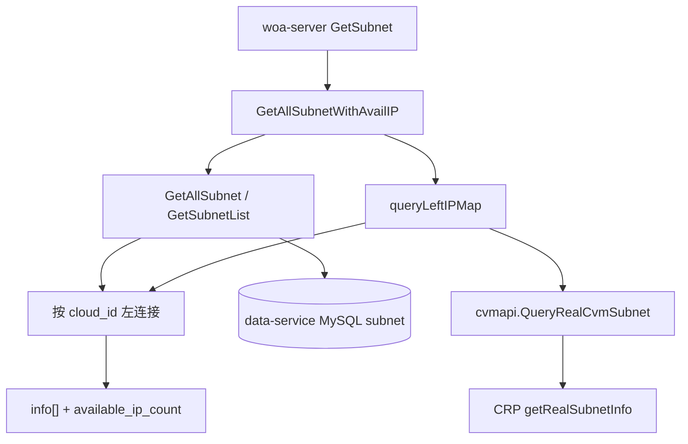

## Context

自研云主机申领等页面的子网下拉数据来自：

```
POST /api/v1/woa/config/findmany/config/cvm/subnet
请求：{ region, zone, vpc }
```

当前链路：`GetSubnet` → `GetAllSubnet` → `GetSubnetList`。清单来自 MySQL `subnet` 表（`enable_cvm = true`）。表结构无 IP 数量字段；同步周期 6 小时，即使落库也无实时价值。

工作区里 `GetSubnetList` 已挂 hc-service `ListCountIP`（TCloud `AvailableIpAddressCount`），`Subnet.AvailableIpCount` 原为 `uint64`。下拉接口需要的是调度同源的 CRP `leftIpNum`，不能把 CRP 嵌进被调度复用的 `GetAllSubnet`。同包 `left_ip.SyncLeftIP` 已是「先 `GetAllSubnet` 取清单，再单独 `QueryRealCvmSubnet`，按 `SubnetId` 合并」的成熟写法，本期下拉路径按同一模式外挂：`GetAllSubnet` 方法体不增加 CRP，`GetSubnetList` 不引入 CRP、仅适配指针赋值。

约束：仅改 woa-server；不改前端、DB、同步、hc-service / cloud-server / data-service；可用 IP 失败不得阻断清单返回。云厂商范围仅自研云（`tcloud_ziyan`）。无新增 IAM / CMDB / ITSM 集成点。

## Goals / Non-Goals

**Goals:**

- 下拉接口每项返回与调度同源的实时可用 IP（CRP `leftIpNum`）
- `AvailableIpCount` 改为 `*uint64`，下拉接口 CRP 失败或未查询时 JSON 为 `null`，与剩余 0 可区分
- 可用 IP 为增量信息：CRP 失败或单项未命中时清单照常返回
- 把 CRP 调用限制在新方法 `GetAllSubnetWithAvailIP` 内；`GetAllSubnet` 方法体不改，`GetSubnetList` 仅适配指针赋值

**Non-Goals:**

- 不改前端（展示文案、口径说明、禁选逻辑由后续前端变更负责）
- 不解决子网清单本身的陈旧性（新建未同步 / 已删未同步）
- 不对齐调度的 `cvm_use` 前缀过滤，不因 `available_ip_count = 0` 从清单中剔除
- 不返回总数 / 已用数（CRP 只返回 `leftIpNum`）
- 不改造配置管理页 `POST .../cvm/subnet/list` 去调 CRP
- 不修复 `capacity.querySubnet` 走 `OldCVM`、调度走 `CVM` 的既有地址分裂（单独立项）

## Decisions

### 决策 1：采用方案 A（woa-server 直连 CRP），不用 TCloud DescribeSubnets

**选择**：在现有下拉接口内调 `cvmapi.QueryRealCvmSubnet`（CRP `getRealSubnetInfo`），用 `leftIpNum` 填 `available_ip_count`。

**备选**：

| 方案 | 做法 | 否决原因 |
|---|---|---|
| B | 调用方改调 web-server `subnets/with/ip_count/list` | 口径是 TCloud `AvailableIpAddressCount`，与调度不一致；all-or-nothing 校验无法按项降级；还要补 `vpc_name` / `enable_cvm` |
| C | woa-server 转调 hc-service `ListCountIP` | 口径同样不是 CRP，无法与调度 `leftIpNum` 对齐 |

**理由**：口径一致性是决定性条件。接口返回值与 `getCvmSubnet` 必须同源，否则后续展示会与提单结果打架。请求侧本就在 region / zone / vpc 齐全时才调用，与 `SubnetRealParam` 对齐，一次请求对应一次 CRP 调用。客户端方法已存在，无需新对接。

### 决策 2：新增 `GetAllSubnetWithAvailIP`，对齐 `left_ip.SyncLeftIP`，不改 `GetAllSubnet`

**选择**：`SubnetIf` 增加 `GetAllSubnetWithAvailIP`；`GetSubnet` 改调该方法。内部与 `SyncLeftIP` 相同三步：

1. `GetAllSubnet` 只取 DB 子网清单
2. 单独 `QueryRealCvmSubnet` 取 CRP `leftIpNum`
3. 按 `SubnetId` ↔ CRP `Id` 左连接，写回 `available_ip_count`

**备选**：直接在 `GetAllSubnet` 内嵌 CRP。否决：调度器 `getCvmSubnet` 已自行调过一次 CRP，再嵌会让每次提单多一次请求；也与 `left_ip` 现有拆分方式不一致。

### 决策 3：CRP 客户端必须用 `thirdCli.CVM`

**选择**：`NewSubnetOp` 将 `subnet.cvm` 从 `thirdCli.OldCVM`（`cvm.old_host`）改为 `thirdCli.CVM`（`cvm.host`）。

**理由**：调度选子网与 `CreateCvmOrder` 都走 `thirdCli.CVM`。`subnet.cvm` 当前从未被引用，改注入不影响既有行为。若继续用 `OldCVM`，口径一致性无从谈起。

`capacity.querySubnet` 仍走 `OldCVM`，属既有问题，本期不改。

### 决策 4：CRP 只在新方法里查，`GetAllSubnet` 方法体不改

**选择**：不删除 `GetSubnetList` 里的 `ListCountIP`，也不改 `GetAllSubnet` 方法体。CRP 查询只出现在 `GetAllSubnetWithAvailIP`（及它调用的 `queryLeftIPMap`）。合并时用 CRP `leftIpNum` 转成 `*uint64` 覆盖 `AvailableIpCount`；失败或未查询写 `null`，单项未命中写 `0`，避免留下 `GetSubnetList` 带出的 TCloud 值。`GetSubnetList` 仅把 `AvailableIpCount` 赋值改成 `ValToPtr`，以适配共用结构，不引入 CRP。

**理由**：与 `left_ip.SyncLeftIP`（`left_ip.go` 142–170 行）同一模式——清单查询与 CRP 查询拆开，互不嵌入。本期目标是给下拉接口补 CRP 字段，不是清理 `GetSubnetList` 的既有 ListCountIP。配置管理页继续走 `GetSubnetList`，成功路径 JSON 仍是数字。

### 决策 5：`AvailableIpCount` 改为 `*uint64`，异常与剩余 0 可区分

**选择**：将 `Subnet.AvailableIpCount` 改为 `*uint64`，JSON 不带 `omitempty`。`cvmapi.SubnetInfo.LeftIpNum` 是 `int`，命中时用 `ValToPtr(uint64(leftIpNum))` 写入（负值按 0）。

**理由**：前端需要把「查失败」展示为 `-`，把「剩余 0」展示为数字 0。值类型无法表达未知。配置列表 `GetSubnetList` 仍用 `ValToPtr` 写入具体数字，失败时保持原「写 0」语义，不把下拉的 null 语义扩散到配置页。

合并规则：

| 情况 | `available_ip_count` |
|---|---|
| DB 有、CRP 命中 | `uint64(leftIpNum)` 指针 |
| DB 有、CRP 调用失败 / region·zone·vpc 不全 | `null` |
| DB 有、CRP 成功但未命中该子网 | `0` |
| CRP 有、DB 无 | 忽略，不新增清单项（`enable_cvm` 仍控制可选范围） |

### 决策 6：不按剩余 IP 或 `cvm_use` 过滤清单

**选择**：维持 `enable_cvm = true` 的现有可选范围；`leftIpNum = 0` 的子网仍返回，`available_ip_count` 为 `0`。

**理由**：改变现网可选范围风险最大。是否禁选、是否对齐调度过滤，由后续产品 / 前端变更决定，本期接口只原样返回容量。

## 架构

分层：Service（woa-server service/logics）→ 外部 CRP。不经过 cloud-server / hc-service 写路径；清单仍读 data-service MySQL。本期不改 Access 层（前端）。



主流程：`GetAllSubnet` 为空则直接返回；region / zone / vpc 不全则跳过 CRP、全部写 `null`；CRP 失败 Warn 后全部写 `null`；成功则按 `SubnetInfo.Id` ↔ DB `cloud_id` 填充，未命中写 `0`。日志记录 CRP `TraceId`，与调度 `crpTraceID` 对账。

## Risks / Trade-offs

- [口径偏差] `cvm.host` 与 `cvm.old_host` 若指向不同 CRP 环境，改用 `CVM` 才能对齐调度；容量查询既有分裂仍在 → 上线前与运维确认两地址关系；本期只保证下拉接口与调度同客户端
- [CRP 耗时叠加到接口] 响应 = DB + 一次 CRP；调用方切换 region/zone/vpc 才触发 → 确认客户端超时，超时走降级而非挂起
- [指针字段牵动共用结构] `Subnet` 被配置列表复用 → 配置列表继续写数字指针，仅下拉路径在未取到时保持 nil
- [清单陈旧] 未同步的新子网不会出现；已删未同步的子网 `available_ip_count` 为 `0` → 只承诺 IP 实时，清单实时单独立项
- [可选范围与调度不一致] 接口仍可能返回 `available_ip_count = 0` 或非 `cvm_use` 子网 → 本期不过滤；若要禁选另开需求
- [GetSubnetList 仍可能打 ListCountIP] 下拉新方法会先走 `GetAllSubnet` 再打 CRP，存在一次额外 TCloud 查询 → 接受；本期不重构共用清单路径。出口字段以 CRP 覆盖为准，避免双重口径漏到下拉响应

## Migration Plan

1. 发布 woa-server：下拉接口的 `available_ip_count` 改为 CRP `leftIpNum`；失败或未查询从 `0` 变为 `null`。`GetAllSubnet` 行为不变。配置列表成功路径仍返回数字。
2. 现网下拉前端尚未展示该字段，忽略 `null` 即可；后续展示须判断 `== null` 画 `-`，不能 `|| 0`。
3. 回滚：回退 woa-server 即可；无 DB / 同步 / 前端变更。回退后下拉接口不再保证 CRP 口径的可用 IP。

## Open Questions

- `cvm.host` 与 `cvm.old_host` 是否同一套 CRP 的不同接入点（影响对容量查询既有分裂的后续处理，不阻塞本期实现）。
