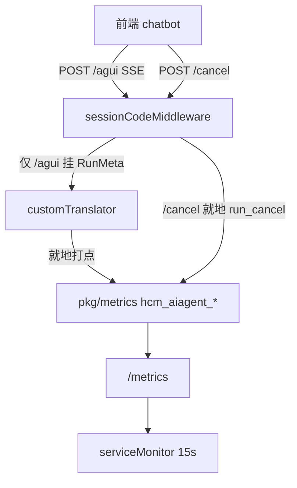

## Context

HCM Agent 的真实对话走 agent-server `POST /agui`（SSE / AG-UI）。框架会把事件写入轨道表 `aiagent_session_track_events`，会话表 `aiagent_session` 只记线程与消息计数。两者都不是运行时看板可用的 run 级口径。

本变更只做反馈机制总方案 **A · 基本统计** 里的监控出口：

```
AG-UI 事件 /cancel ──就地打点──▶ 监控指标 hcm_aiagent_*（看板 / 告警）
```

`aiagent_run` 落库、data-service、`/cancel` CAS、孤儿清扫不在本期。

现有可复用点：

- `pkg/metrics`：`sync.Once` + `EnsureXxxMetric()` + `ObserveXxx()`，**没有业务 enabled 开关**。
- `sessionCodeMiddleware` 已解析 session、生成 `runId`、拿到 `SessionMeta`。
- `customTranslator` 是项目对 AG-UI 翻译的唯一扩展点。

指标 label 用已有约定 `state`（`pkg/metrics.LabelState`）。业务 ID 用 `metrics.LabelBKCCBizID`（`bkcc_biz_id`）。

## Goals / Non-Goals

**Goals:**

- 运行时上报 `hcm_aiagent_*`，看板可看发起量、完成 / 失败占比、取消率、耗时分布。
- 打点失败不影响主对话；打点不依赖写库。

**Non-Goals:**

- `aiagent_run` 表、DAO、data-service 内部接口、异步落库、`/cancel` CAS、`pkg/cron` 清扫。
- 主动反馈（点赞/点踩/评语）与反馈表。
- 被动模型评估落地。
- `stats/run_overview`、`POST /api/v1/agent/stats/run_list` 及前端明细页。
- 新 IAM 权限点、`runObservation.enabled` 总开关。
- 修改 AG-UI 协议、`/agui` 对外契约、会话 CRUD。

## Decisions

### 1. 指标没有 enabled 开关，与现有 metric 一致

**现状核对**（`pkg/metrics/clb_submit.go`、`http_request.go`）：启动时 `EnsureXxxMetric()` 注册；业务路径命中就打点；打点函数不返回 error、不做 IO；没有任何 `xxx.enabled`。

**选择**：`hcm_aiagent_*` 同样常开。不设 `runObservation.enabled`。不设 `write_fail_total`。

### 2. cancel 不进 `run_total`

**选择**：`run_total` 只反映终态 `finished` / `error` / `unknown`。进行中由 `hcm_aiagent_run_inflight` 呈现。用户点停止单独计 `hcm_aiagent_run_cancel`。

**理由**：`/cancel` 之后框架仍会补发 `RUN_FINISHED`（失败则 `RUN_ERROR`）。cancel 独立后不必用 DB 给指标去重。

### 3. 观测挂在翻译后的 AG-UI 事件上

**选择**：在 `customTranslator.Translate` 与 `PostRunFinalizationEvents` 之后检查输出事件。有本轮元数据才打点；没有则立刻返回（挡住 `/history`）。

硬约束：回调不改写事件、不向框架报错、吞掉自身 panic；打点就地完成，不放进异步重试循环。

### 4. 本轮元数据只挂在 `/agui`

**选择**：`sessionCodeMiddleware` 仅在 `/agui` 且 session 校验通过后挂 `RunMeta`（run_id、session_code、user、bk_biz_id、scene、started_at）。`/history` 不挂。`/cancel` 不挂新 run，但要能读 session 上下文以便打 `run_cancel` 的 label。

`scene` 入口取 `SessionMeta.SessionTag`（拿不到留空）。终态 `run_total` / `duration` 在打点前用本轮 graph 最终 state 里的 `session_tag`（scene_dispatch 提交值）覆盖。

### 5. 指标清单与打点位置

`AiagentSubSys = "aiagent"`，`pkg/metrics/aiagent.go`。`app.prepare()` 在 `InitMetrics` 之后立刻 `EnsureAiagentMetric()`。

| 指标 | 类型 | label | 打点 |
|---|---|---|---|
| `hcm_aiagent_run_total` | Counter | `state`、`bkcc_biz_id`、`scene` | 事件回调就地；`unknown` 仅在后续清扫落地后按实际影响行数计 |
| `hcm_aiagent_run_duration_seconds` | Histogram | `state`（仅 `finished`/`error`）、`scene` | 与 finished/error 同一处 |
| `hcm_aiagent_run_inflight` | Gauge | `bkcc_biz_id` | 仅事件回调 ±1；**不带 `scene`** |
| `hcm_aiagent_run_cancel` | Counter | `bkcc_biz_id`、`scene` | `/cancel` 鉴权解析后立刻打，一次请求计一次 |

约束：`/cancel` 不减 `inflight`；耗时不统计 cancel / unknown；打点函数不返回错误、不做 IO。`run_total` 不含 `running`。

### 6. 分层与调用链



## Risks / Trade-offs

- [口径] 点了停止的一轮，指标可能是 `run_cancel` + 随后的 `finished`/`error`。看板完成率分母用 `sum(run_total)`，取消量看 `run_cancel`。
- [热路径] 打点 / 观测回调出问题会拖主对话 → 不返回 error、recover panic。
- [重复 /cancel] 一次请求计一次 → 取消率可能偏高。

## Migration Plan

1. agent-server 发布：`EnsureAiagentMetric`、`RunMeta`、事件与 `/cancel` 就地打点。
2. 监控侧加 `hcm_aiagent_*` 看板与告警（失败率、取消率、P95）。
3. 回滚：停发 agent-server 该版本。Counter 进程重启从 0 累加，`rate`/`increase` 不受影响。

## Open Questions

无。落库 / 清扫默认周期与阈值留到后续需求。
